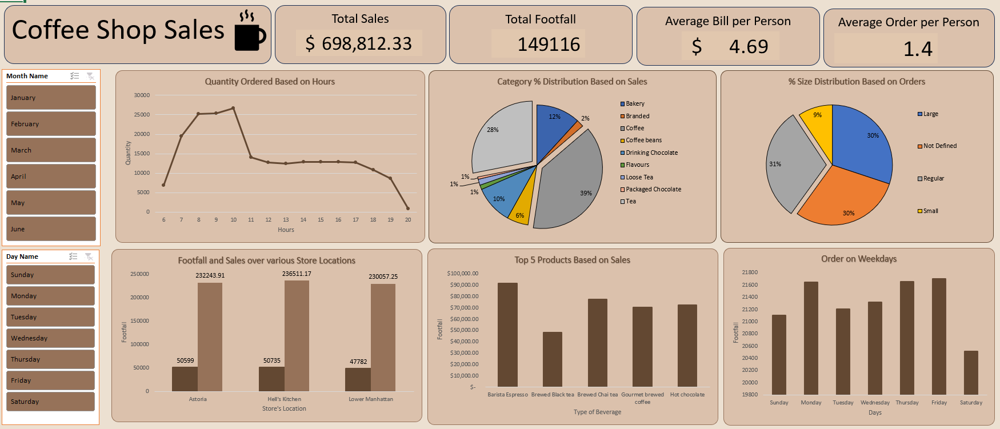

# Coffee Shop Retail Sales Analysis Project ☕

# **Project Overview** 🔍
The goal of this project is to analyze retail sales data for a coffee shop to uncover actionable insights that will enhance business performance. By leveraging Excel’s advanced functionalities, including charts and dynamic dashboards, we aim to answer key business questions and present insights in an intuitive and visually engaging manner.

---

## **Problem Statement** 📊
The main objective of this project is to analyze retail sales data to gain actionable insights that will enhance the performance of the coffee shop. The project specifically addresses the following questions:

1. **How do sales vary by day of the week and hour of the day?**
2. **Are there any peak times for sales activity?**
3. **What is the total sales revenue for each month?**
4. **How do sales vary across different store locations?**
5. **What is the average price per order?**

---

## **Deliverables**

### **1. Dynamic Dashboard**
- A visually appealing and interactive Excel dashboard summarizing:
  - **Day and Hour Trends:** Heatmaps or line charts showing sales trends by day of the week and hour of the day.
  - **Peak Sales Activity:** Identification of peak hours and days.
  - **Monthly Revenue:** Bar or line charts displaying total sales revenue by month.
  - **Location-Based Analysis:** Comparative charts (e.g., bar or map visualizations) for sales across different store locations.
  - **Average Price/Order:** A KPI card or summary metric showing the average order price.

### **2. Excel Workbook**
- A workbook with:
  - **Processed Data Sheet:** Includes calculated columns for day, hour, month, and other derived metrics.
  - **Dashboard Sheet:** Hosts the dynamic dashboard.

---

## **Key Features**

### **Data Preparation**
1. **Data Cleaning:**
   - Prepare columns for timestamps, store locations, and sales amounts.

2. **Data Transformation:**
   - Extract day of the week, hour, and month from transaction timestamps.
   - Calculate sales revenue, order counts, and average price per order.

### **Dynamic Visualizations**
- **PivotTables:**
  - Summarize sales data by day, hour, month, and location.
- **Slicers:**
  - Add slicers for interactivity (e.g., filter by month or location).
- **Charts:**
  - Create heatmaps, bar charts, and line graphs for trend analysis.
- **Conditional Formatting:**
  - Highlight key insights such as peak sales times.

### **Calculated Metrics**
- **Day and Hour Analysis:**
  - Use formulas or PivotTables to group sales by day and hour.
- **Monthly Revenue:**
  - Aggregate total sales by month.
- **Location Comparison:**
  - Calculate total and average sales for each store location.
- **Average Price per Order:**
  - Formula: `Total Revenue / Total Orders`.

---

## **Expected Insights**
- Identification of peak sales hours and days for optimal staffing and promotions.
- Monthly revenue trends to track performance and seasonality.
- Comparison of sales performance across store locations for strategic decision-making.
- Calculation of average price per order to evaluate pricing strategies.

---

## **Requirements**
- **Software:** Microsoft Excel (2016 or later recommended for advanced features).
- **Skills Needed:**
  - Familiarity with PivotTables and PivotCharts.
  - Understanding of Excel formulas (e.g., `SUM`, `AVERAGE`, `IF`, `TEXT`).
  - Basic knowledge of conditional formatting and data visualization techniques.

---

## **Future Enhancements**
- Integrate Power Query for automated data cleaning and transformation.
- Use Power BI for more advanced visualizations and deeper insights.
- Implement forecasting models to predict future sales trends.

## **Screenshots**
### Coffee Shop Sales Dashboard 

